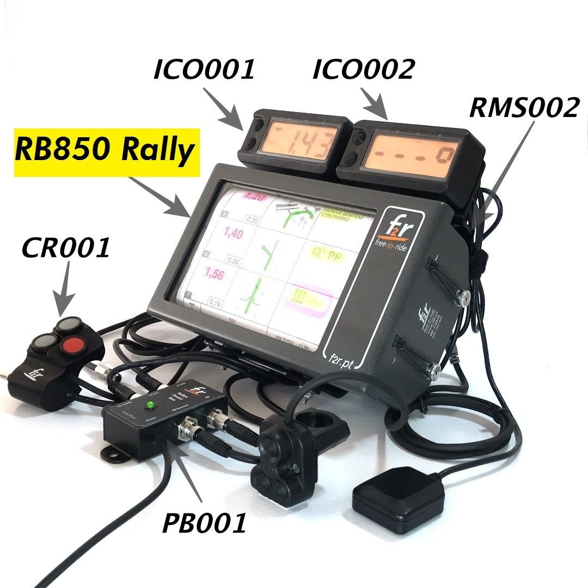

## Making a Arduino/Bluetooth HID
Recently an acquaintance of mine had attended a motorcycle event where one of the attendants had made their own device that could remotely control a map application on an iPad.
After a short discussion when he returned I agreed to make such a device for him.

#### So why is it desirable to remotely operate an iPad?
First we need to look at what the iPad is replacing, traditionally you would use a roadbook and trip counter to follow a route as shown below. The image shows a mechanical roadbook with a paper roll, but electronic versions are also available.

As a casual motorcyclist it would be easier to set a route in an application like (https://gurumaps.app/)[Guru Maps], but as one can imagine, operating an iPad while driving a motorcycle with gloves on can prove impracticable. The solution could be to use a remote controller that doesn't rely on a touchscreen.

#### Interfaces
To make the Bluetooth controller I relied on the fact that there is an existing interface to control a roadbook and a trip counter. The specific device we ended up using is the one marked as **CR001** in the above image.

The map application we tested, Guru Maps, had support for Bluetooth Keyboard shortcuts, making the simplest possible way to achieve my goal be to make an Arduino device with a Bluetooth module that emulates a Keyboard

#### Arduino and electronics
I haven't played around with Arduino in ~10 years, but I know enough to get started with the electronics part and as a programmer I was confident I could get the code part done quickly. As a starting point I based the project around the (https://www.adafruit.com/product/2829)[Adafruit Feather 32u4 Bluefruit LE], partly due to being an Arduino with a Bluetooth module pre assembled but also to support their excellent open source libraries that I ended up using in the project.

#### Mapping the input
Now back to the remote switch, it has two **M8** connectors, a 3 pole and a 4 pole, but I had no internal schematic at the time so I had to map this out myself. The toggle switch used the 4 pole connector and mapping it was pretty straight forward. The buttons used the 3 pole connector and that would mean some sort of multiplexing was involved, it turned out to be an analog button scheme and it wasn't too hard to figure out once I pulled out Excel (actually Google sheets, but some brands are just synonymous with the task).

#### Making the prototype
Initially I built the device on a breadboard. Using (https://github.com/adafruit/Adafruit_BluefruitLE_nRF51)[Adafruits BLE library], getting the code up and running was pretty quick. Afterwards it was time to make a proper prototype and, well, its pretty clear I don't have any prior experience with this.

So about that awkward USB power solution, if I had read the schematics properly, if I had the proper experience at the time, I wouldn't have to make such an abomination. As you might spot from the labeling on the screw terminals, I power the unit directly from the 12V of the motorcycles electrical system and use a linear voltage regulator to get 5V.

Also those legs used instead of proper solder connections, as one might guess they didn't fare to well when put on a motorcycle and exposed to vibration and broke easily. I tried to solder connections between the pads, but my lack of experience and no frills straight in wall socket solder iron just burned the pads off.

#### 2nd revision - PCB
While the first prototype did work I wasn't really satisfied with it, particularly the connections on the underside. After watching several YouTube videos on the subject over the years I decided on having a PCB made, despite never having done it before it was actually quite easy once I learned the basics.

There are many different CAD software for making PCB, I ended up using [EasyEDA](https://easyeda.com/) due to exposure from YouTube videos. For those of you who aren't familiar with the design process, its a two step process where you first draw up the schematic and then lay out the parts you drew earlier.

The advantage of having a two step process is that we can have a high level of view of the design and we can look at parts individually and group them by function unhindered by board connectivity. The connection is taken cared of by naming the wires, in this schematic its either the power/ground symbols or the blue wedges. Each item is named, like C1 & C2 for the capacitators and has an associated **footprint**. A footprint is the physical space of a component and becomes important when we need to lay out the components on the PCB in step 2. The footprint in itself is also just a drawing like the schematic, but we take care to have precise measurements to mimic the real life physical dimensions of the part we are modeling.

*2.54mm is a common pitch, a pitch being the length between the pins of a component. The footprint doesn't actually include this measurement as its too verbose and I drew it to illustrate a point*

Once we have everything connected in the schematic we can move on to step two and lay out the board. The program can automatically convert our schematic to a PCB layout by the way of the associated footprints. It also knows which lines needs to be connected according to our schematic, here represented as the thin blue lines called **ratlines**.

There are a few rules that needs to be followed here, first of all you need to know the capabilities of the manufacturer you intend to use, I used [jlcpcb](https://jlcpcb.com/) and they have their [capabilities](https://jlcpcb.com/capabilities/Capabilities) listed here. No item can occupy the same physical space and no lines can cross each other. Having no lines ever crossing becomes almost impossible when your board has some ~20 connections, the solution is to have a multilayer board and let the lines go on multiple layers. The pads I use in this design are all through hole, meaning they pass trough the entire board, and such they can connect to the two layers I'll be using.

Adhering to these rules, its all about rotating and moving the parts until the fit inside the purple box that indicates the board size (which can be adjusted as needed, but you generally want to be as compact as possible and fit to an enclosure). Once everything fits you can start drawing lines to connect the parts, on this drawing red lines are on the top layer and blue lines on the bottom layer.

Note that the white lines wont show up in the final design, they are just to comment. The yellow and green lines do show up on the top and bottom layer and are called **silk screens**.

For the record, the OLED screen and tactile button on the bottom of the board (green lines) was dropped as it just barely couldn't fit in the enclosure I had selected, had I 3d modeled the board and enclosure I could have spotted this before ordering the boards. The real culprit was the linear regulator, it has legs that gets wider near the component that I failed to take into account.

The final result of revision 2 of the board ended up looking quite a bit nice than the first prototype. Also note that I am now powering the Bluefruit directly trough the **VBUS** pin instead of that quite literally hacky USB cable I used earlier.

#### 3rd Revision
While I haven't made a third revision yet, there are a few items I would want to improve.

* 3d Model the project
  * Make sure the board and parts fit perfectly inside the enclosure
  * Model mounting holes on the board
* Get rid of the Bluefruit
  * The Bluefruit was very helpful as a prototyping tool, but its too costly for manufacturing additional units
  * It can be replaced by a AVR processor, a Bluetooth module board and a 3.3V regulator
* Replace the screw terminals with **M8** connectors and drill holes trough the enclosure
  * No more wire spaghetti on the inside
